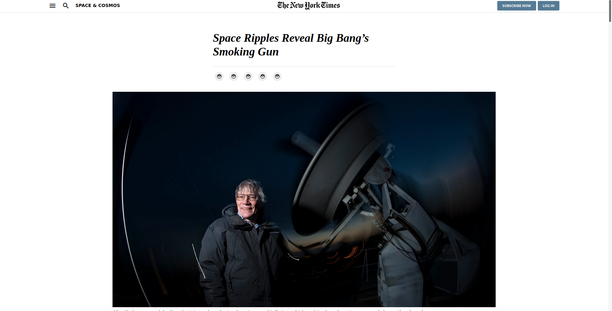

# Project 1: Positioning and Floating Elements

> Module: HTML & CSS3.

The idea behind this project is to copy the New York Times article.

## Built With

- HTML
- CSS
- Materialize Icons

## Live Demo

[Live Demo Link](https://livedemo.com)

## Getting Started

To get a local copy up and running follow these simple example steps.

### Setup
 - open your Terminal and go to the desired folder
 - git clone https://github.com/fernandorpm/mv-project1.git

## Authors

👤 **Fernando Marques**

- GitHub: [@githubhandle](https://github.com/fernandorpm)
- Twitter: [@twitterhandle](https://twitter.com/rpm_fernando)
- LinkedIn: [LinkedIn](https://linkedin.com/fernandorpm)

## 🤝 Contributing

Contributions, issues, and feature requests are welcome!

Feel free to check the [issues page](issues/).

## Show your support

Give a ⭐️ if you like this project!

## Acknowledgments

- Hat tip to anyone whose code was used
- Inspiration
- etc

## 📝 License

This project is [MIT](lic.url) licensed.
